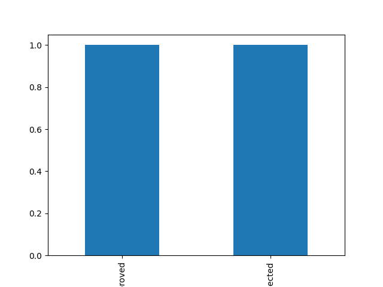

# 💰 Financial Data Analysis & Reporting System

## 📌 Overview
This project analyzes financial loan data using Python to generate insights for decision-making. It simulates real-world fintech systems like Loan Origination Systems (LOS) and Loan Management Systems (LMS).

---

## 🚀 Features
- Data cleaning and preprocessing using Pandas
- Financial metrics analysis (loan amount, interest trends)
- Data visualization using Matplotlib & Seaborn
- Automated reporting system
- Streamlit dashboard for interactive UI

---

## 🛠 Tech Stack
- Python
- Pandas, NumPy
- Matplotlib, Seaborn
- Streamlit

---

## 📊 Sample Output

- Total Loan Amount: ₹1,50,000  
- Average Interest Rate: 10.5%  



---

## 💡 Real-World Use Case
This project is inspired by fintech applications where financial data is analyzed to support loan approvals, risk assessment, and business insights.

---

## ▶️ How to Run

```bash
pip install -r requirements.txt
python main.py
streamlit run app.py
